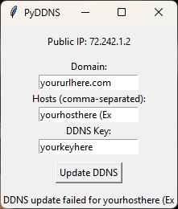

# PyDDNS
A GUI for pushing your public IP to your A name records of your domain.

#### Note: 
If you need multiple domains simply copy the folder and rename it, Then you can open the PyDDNS program again to link another domain.

## Screenshots

## Prerequisite 
Requires Python:
https://www.python.org/downloads/

#### DDNS Domain Config
- The first thing you need to do is to enable Dynamic DNS for your domain yourdomainhere.com.
- You will then receive an auto-generated Code or Key, you'll copy/paste that into the program.  
- Now create an A record for the host "Ex: www and @" and point it to your current Public IP.
- Enter all your information into the program and click the "Update DDNS" button.
- If you set everything up correctly you will receive a success message.

## Features
- Auto-refresh every 3 hours
- Displays your current Public IP
- Manual update button
- Multiple host entries
- Saves your inputs
- Cross-platform
- Success/Failure Status
