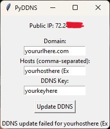

# PyDDNS

A GUI for pushing your public IP to your A name records of your domain.

#### Note: 
If you need multiple domains simply Copy the folder and rename it, Then you can open the PyDDNS program again to link another domain.

## Screenshots

## Prerequisite 
Requires Python3 or above:
https://www.python.org/downloads/
## Features

- Auto-refresh every 3 hours
- Displays your current Public IP
- Manual update button
- Multiple host entries
- Cross-platform
